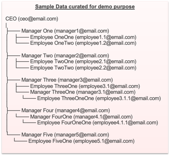

# LeaveLog Web Application

## Overview
LeaveLog is a comprehensive tool designed to simplify the management of employee leave requests for teams and HR departments.

## Prerequisites
Ensure you have the following installed on your system:
- **Java**: JDK 21
- **Spring Boot**: Version 3.2.4 (comes with Apache Tomcat as the default servlet container)
- **Maven**: Version 3.9.1
- **PostgreSQL**: Version 16.2
- **IntelliJ IDEA**: Version 2023.3.2

## Slides Deck  and Video Demo
Both the slides deck and the video demo are available in thie repo should there be any issues in running the app. 

## Build and Run the Application

### Setup
1. Clone the repository to your local machine.
2. Open the cloned directory using IntelliJ IDEA.
3. Verify that the prerequisites are correctly configured in your system's PATH.
4. Review and resolve any dependencies issues in the `pom.xml` file.

### Configuration
1. Update the `application.properties` file with your PostgreSQL credentials and the Gemini API key.
2. The `resources` directory contains `schema.sql` and `data.sql` for database initialization.

### Running the Application
1. Navigate to the `src/main/java/com/lms/LeaveManagementSystemApplication.java` file.
2. Run the `LeaveManagementSystemApplication.java` to start the server.
3. Access the application by visiting `http://localhost:8080` in your web browser.

### Default Login Credentials
Use the following credentials to log in and interact with the system:
- **Email**: `manager1@email.com` or any of the email address in the picture below
- **Password**: `123456`

